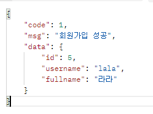
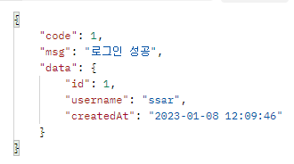
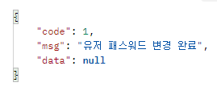
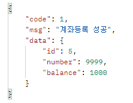
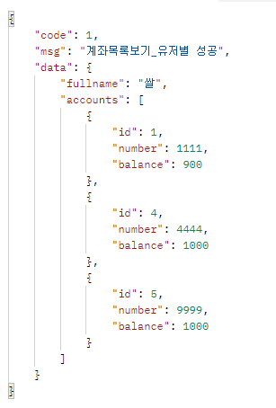
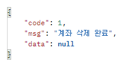
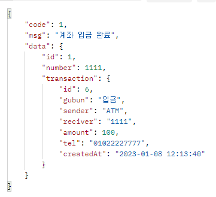
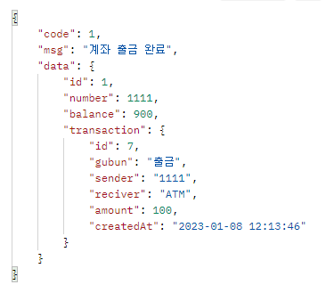
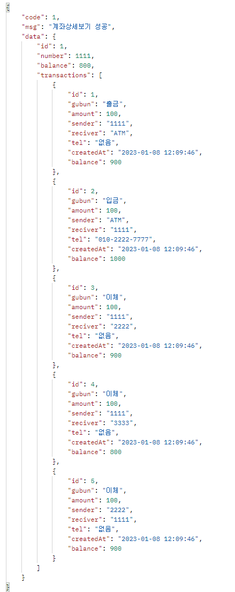
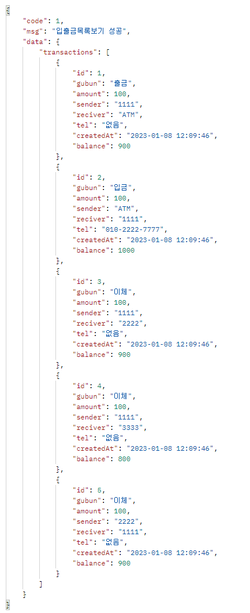

# Bank API 문서

### 회원가입 : POST
- http://localhost:8080/api/join
- body
```json
{
    "username":"lala",
    "password":"1234",
    "email":"lala@nate.com",
    "fullname":"라라"
}
```


### 로그인 : POST
- http://localhost:8080/api/login
- body
```json
{
    "username":"ssar",
    "password":"1234"
}
```


### 패스워드변경 : PUT
- http://localhost:8080/api/s/user/login-user/password

- header 
```txt
Authorization : Bearar 토큰
```
- body
```json
{
    "currentPassword":"1234",
    "newPassword":"1235"
}
```


### 계좌등록 : POST
- http://localhost:8080/api/s/account
- header 
```txt
Authorization : Bearar 토큰
```
- body
```json
{
    "number":9999,
    "password":1234
}
```


### 계좌목록 : GET
- http://localhost:8080/api/s/account/login-user
- header 
```txt
Authorization : Bearar 토큰
```


### 계좌삭제 : DELETE
- http://localhost:8080/api/s/account/{accountNumber}
- header 
```txt
Authorization : Bearar 토큰
```


### 계좌입금 : POST
- http://localhost:8080/api/account/deposit
- header 
```txt
Authorization : Bearar 토큰
```
- body
```json
{
    "number":1111,
    "amount":100,
    "gubun":"DEPOSIT",
    "tel":"01022227777"
}
```


### 계좌출금 : POST
- http://localhost:8080/api/s/account/withdraw
- header 
```txt
Authorization : Bearar 토큰
```
- body
```json
{
    "number":1111,
    "amount":100,
    "password":1234,
    "gubun":"WITHDRAW"
}
```


### 계좌이체 : POST
- http://localhost:8080/api/s/account/transfer
- header 
```txt
Authorization : Bearar 토큰
```
- body
```json
{
    "withdrawNumber":1111,
    "depositNumber":2222,
    "amount":100,
    "withdrawPassword":1234,
    "gubun":"TRANSFER"
}
```


### 계좌상세 : GET
- http://localhost:8080/api/s/account/{accountNumber}
- header 
```txt
Authorization : Bearar 토큰
```


### 거래내역 : GET
- http://localhost:8080/api/s/account/1111/transaction?gubun=ALL&page=0
- header 
```txt
Authorization : Bearar 토큰
```
- param 
```txt
gubun=ALL or DEPOSIT or WITHDRAW -> null 허용
page=정수 -> null 허용
```
